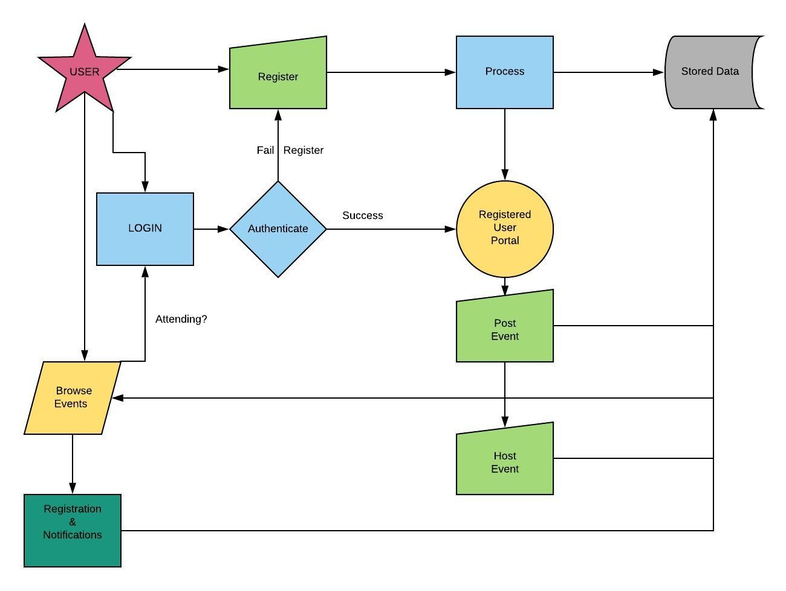
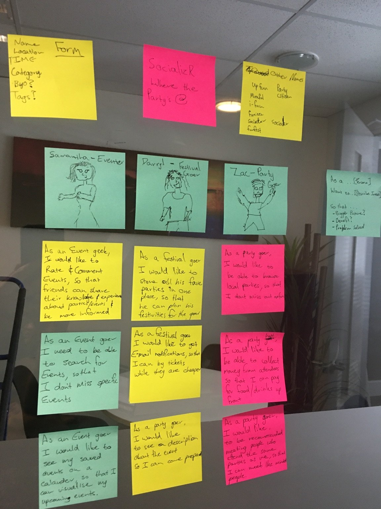

# Socialzr - Not Just Another Event App

Full Stack Application using MERN Stack, Designed and Development by:  
Stephanie Hales
  
Phillip Yoo
  
Dax Scholtz 

## Purpose

The purpose of this application is to allow people wanting to attend events of all kinds, an easier way to manage their yearly festive events. It aims to connect like minded people, provide local event listings which may not be listed on social media platforms, and share events we all come across. 

## Functionality / Features

#### User Accounts

There are two levels of accounts, Host, and Attendee. Users will be able to discover friends and like-minded event attendees. 
  

#### Event List

The event list will allow people to discover festivals, events, and parties. This is open to both user accounts and people browsing the app. To attend an event, an account will need to be created. 
 

#### A "favorites" or "My Events" list
This will allow users to create a list of their favourite events, and receive notifications when event tickets are on sale. 
  

## Target audience

This application has been designed for people of all ages, creeds, and colours. The functionality has been further developed to incite people with busy lives, who still want to attend upcoming events, and have the ability to add it to their personal calendar. Those 'early birds' have not been forgotten, the notification for sale tickets allows people wanting to get the best deal, as well as students living on that 2-minute noodle diet to get a good deal for the next event they've been waiting for. Everyone attends events, so this application is for anyone who enjoys connecting with others. 

## Tech stack

- MongoDB 
- Express.js
- React
- Node.js
- Mongoose 
- Heroku
- Netlify 

## Data Flow Diagram

## Application Architecture Diagram

## User Stories

## Wireframes 

## Trello Board